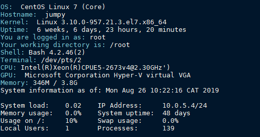

# Custom motd 

### Installation:

- download the file under /etc/profile.d/ 
-     chmod +x /etc/profile.d/mymotd.sh

### Test it with:
    sh /etc/profile.d/mymotd.sh

### WARNING!
* The text is formated to work with a dark background. Please change the color formatting if you use a light background on your shell.
* The file above is provided without any waranty.
